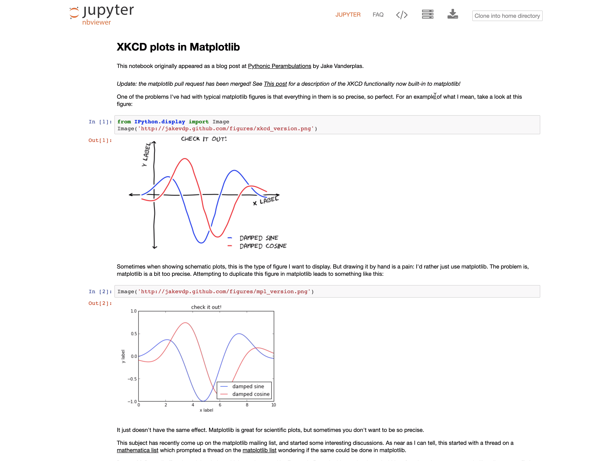
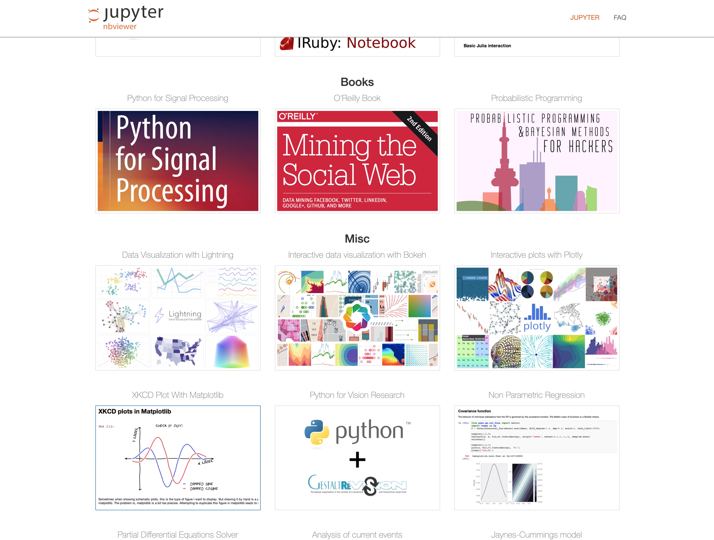
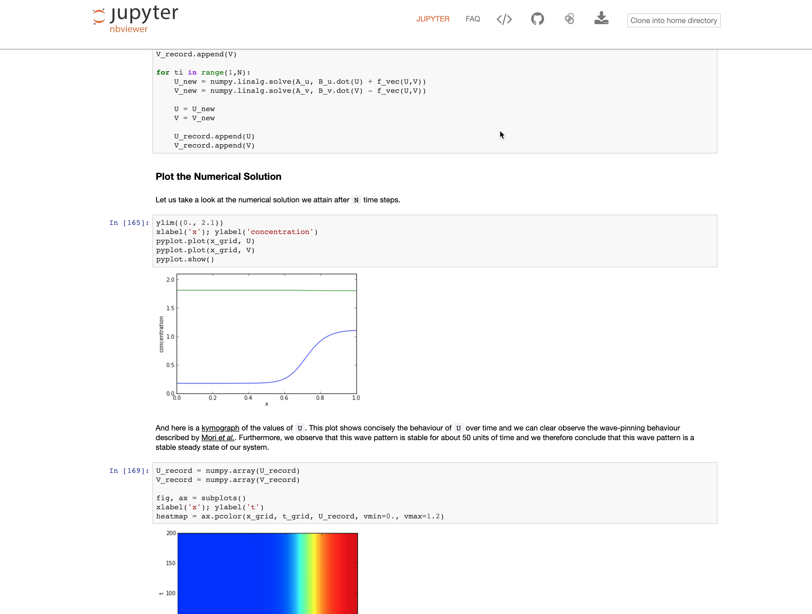
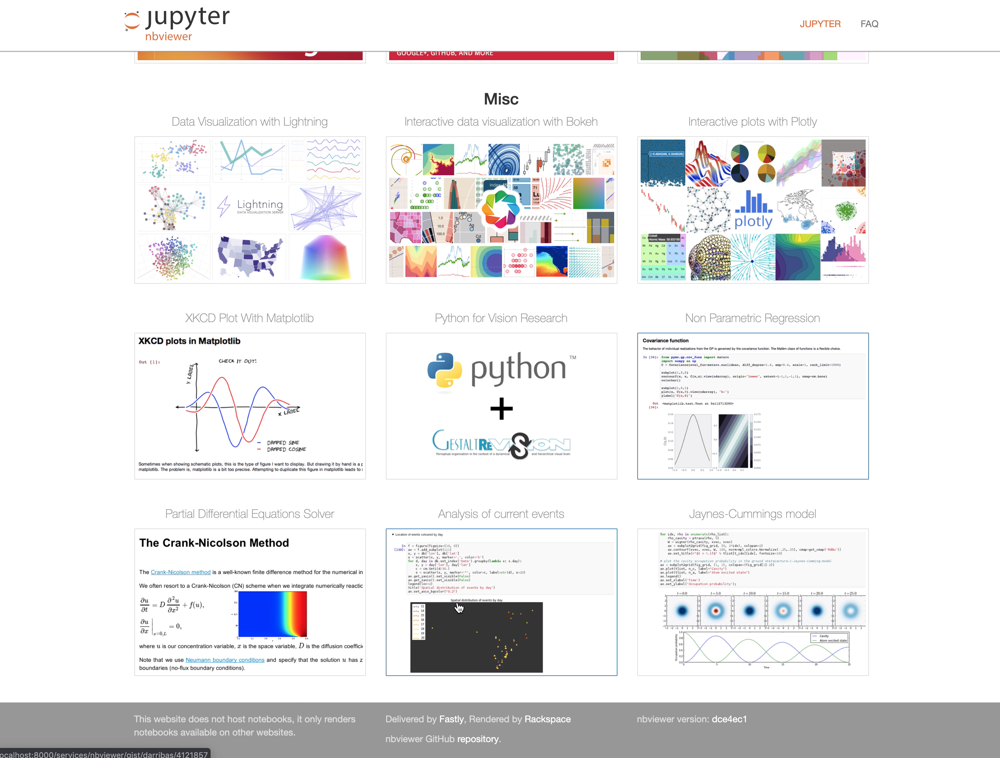
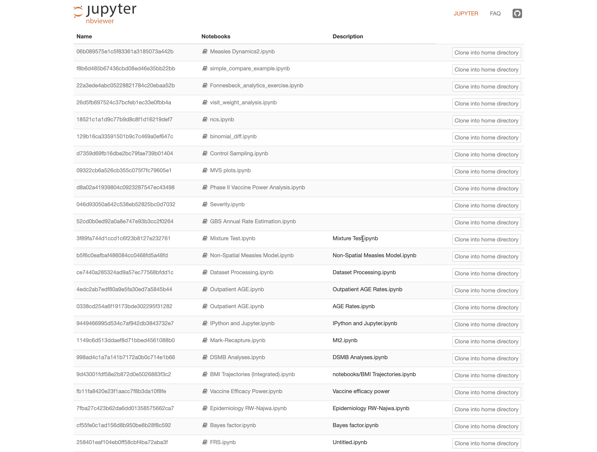
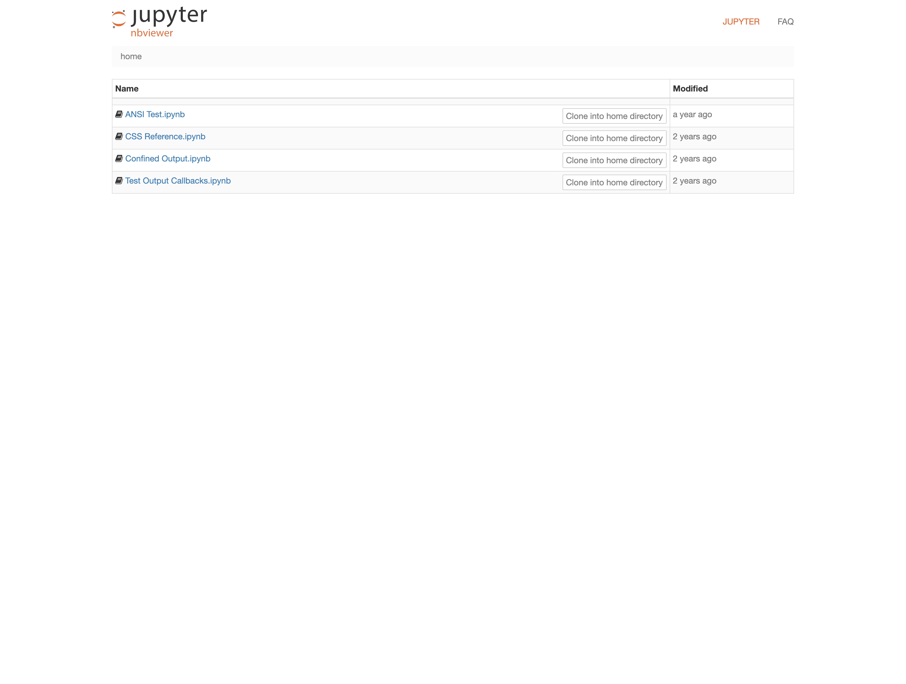
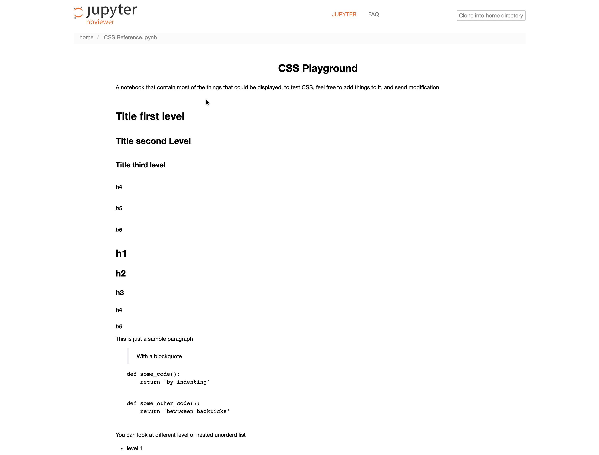

This was built starting from
[Daniel Allan's notebook clone extension](https://github.com/danielballan/notebook-clone-extension) as a basis. It currently
requires branch `step7` of [my fork of NBViewer](https://github.com/krinsman/nbviewer) in order to run.

## Installation Instructions

The easiest and quickest way to get a version of this up and running
to test out would be to use the Docker image and setup instructions included in the [`Docker` subfolder of this repository](https://github.com/krinsman/clonenotebooks/tree/master/Docker).

Otherwise install branch `step7` of [my fork of NBViewer](https://github.com/krinsman/nbviewer) using the same installation
instructions as for the Jupyter master branch, in particular the setup
instructions for using NBViewer as a JupyterHub service. Then download this repository,
and in the folder run (the dot is important, it means "present working
directory"):

    pip install .

if you don't want to make changes to the source code, otherwise

    pip install -e .

This installs the corresponding Python package, but we still need to
tell Jupyter to use the appropriate sub-module as a notebook server
extension. To do this, run:

    jupyter serverextension enable clonenotebooks.cloners --sys-prefix

Make sure you have `nbviewer` installed as a Python package, via Pip
or Conda or whatever else, on order for this to work.

Then copy the `templates` folder to your preferred location, and add
to the command for NBViewer in your `jupyterhub_config.py` file

    --template-path=/your/preferred/location

Then make sure to include an `nbviewer_config.py` file (this is a major why
for now using
[my fork of NBViewer](https://github.com/krinsman/nbviewer) is
necessary) with the lines:

    c.NBViewer.handler_settings    = {'clone_notebooks' : True}
    
    c.NBViewer.local_handler       = "clonenotebooks.renderers.LocalRenderingHandler"
    c.NBViewer.url_handler         = "clonenotebooks.renderers.URLRenderingHandler"
    c.NBViewer.github_blob_handler = "clonenotebooks.renderers.GitHubBlobRenderingHandler"
    c.NBViewer.github_tree_handler = "clonenotebooks.renderers.GitHubTreeRenderingHandler"
    c.NBViewer.gist_handler        = "clonenotebooks.renderers.GistRenderingHandler"
    c.NBViewer.user_gists_handler  = "clonenotebooks.renderers.UserGistsRenderingHandler"

By default notebooks are cloned into the root directory as determined by the value of `c.Spawner.notebook_dir` in `jupyterhub_config.py`. For cloning notebooks into another directory, the line `c.NBViewer.handler_settings` in `nbviewer_config.py` needs to be modified as follows:

    c.NBViewer.handler_settings    = {'clone_notebooks' : True, 'clone_to_directory' : <desired directory here>}

One can include `{username}` as a stand-in for the JupyterHub user's name, analogous to the settings for `c.Spawner.notebook_dir` and `c.Spawner.default_url` in `jupyterhub_config.py`. For example the following is valid:

    c.NBViewer.handler_settings    = {'clone_notebooks' : True, 'clone_to_directory' : '/users/{username[0]}/{username}'}

will cause notebooks to be cloned into `/jupyter/users/f/foo` for user `foo` and `/jupyter/users/b/bar` for user `bar` if the value of `c.Spawner.notebook_dir` is `'/jupyter'`, and will cause notebooks to be cloned into `/users/f/foo` for user `foo` and `/users/b/bar` for user `bar` if the value of `c.Spawner.notebook_dir` is `'/'`. In particular, the destination where notebooks is cloned will **always** be relative to the contents manager's root directory (which will usually equal the value of `c.Spawner.notebook_dir`).

An example copy of `nbviewer_config.py` is also included in this repository, in the [`Docker` subfolder](https://github.com/krinsman/clonenotebooks/tree/master/Docker). Ideally this
should have everything configured, but admittedly these setup instructions are more
vague than they could be and might not have suggested an important step. 

I recommend comparing with the Dockerfiles in the [`Docker` subfolder of this repository](https://github.com/krinsman/clonenotebooks/tree/master/Docker) for an example setup
if any difficulties arise. Please give any and all feedback about any ways in
which the documentation could be improved, since it will be much
appreciated. [Here is a link to the issues page](https://github.com/krinsman/clonenotebooks/issues)
for requests for improved documentation and/or general feedback.

## Kernelspec Cloning

For notebooks from almost any source (local, Gist, URL), `clonenotebooks` checks for a "local" kernelspec (`kernel.json`) file located in the same directory as the notebook being cloned, with the assumption that this kernelspec can be used at the clone destination to load the environment needed to run the environment. If it finds one, the kernelspec is installed in addition to the notebook being cloned. The name given to the kernelspec (i.e. the name of the corresponding directory in `<environment_path>/share/jupyter/kernels`) is by default the name of the enclosing directory. ("Kernel name" as used here should not be confused with the `display_name` attribute of the `kernel.json`, which is what is visible to the end-user and does not need to be unique.) (In the case of notebooks from URLs or Gist, "enclosing directory" refers to the "base name" of the URL "path" excluding the filename, e.g. `test` in `https://example.com/test/notebook.ipynb`.) If a kernelspec with the same name is already found, the previous one is overwritten. In particular, if you update the kernelspec (`kernel.json`) file in the directory and then clone another notebook from that directory, the updated kernelspec will replace the previous one.

The behavior is somewhat different for notebooks sourced from **GitHub**. First, `clonenotebooks` checks for a "global" kernelspec located at the repository's root directory. Second, it checks for a "local" kernelspec in the notebook's directory as in the cases above. If a "local" kernelspec is found, regardless of whether a "global" kernelspec is also found, the "local" kernelspec will be installed, and under the name `<repo_name>-<branch_name>-<enclosing_directory>` (so as to avoid name conflicts with any "global" kernelspecs). If a "global" kernelspec is found, but no "local" kernelspec is found, then the "global" kernelspec is installed under the name `<repo_name>-<branch_name>`. (For notebooks located in the repository root, any `kernel.json` located also in the repository root will be treated as a "global" kernelspec, and thus installed under `<repo_name>-<branch_name>`, even though in this case the `kernel.json` is technically also a "local" kernelspec.)

"Global" kernelspecs could probably be implemented for other notebook sources if there is demand for the feature and if sensible defaults can be chosen for the locations to check for the "global" kernelspec.

## Features

This extension can clone notebooks served from:

* URL

* GitHub tree view

* GitHub individual file view

* individual GitHub Gists

* Gist's from a user's page

* local files from a directory

* individual local files

### Attributions

Example notebooks included in multiple-container Dockerfile demo are from the [Jupyter gallery of interesting notebooks](https://github.com/jupyter/jupyter/wiki/A-gallery-of-interesting-Jupyter-Notebooks). Credit for them belongs to their respective authors ([Filipa Rodrigues](https://www.linkedin.com/in/filipacrodrigues/), [Jason Chin](https://twitter.com/infoecho), [Shashi Gowda](https://github.com/shashi)).
